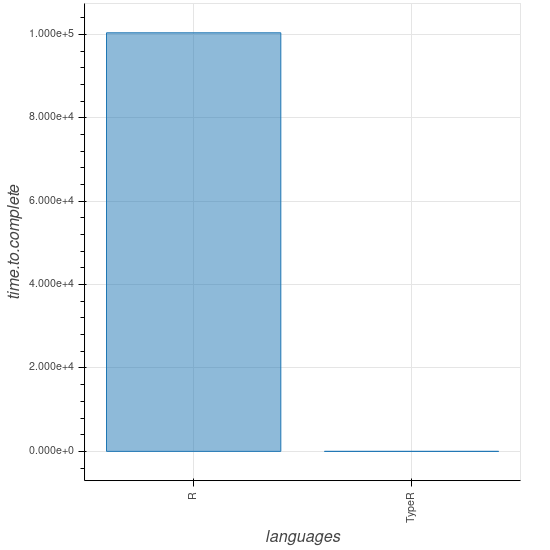
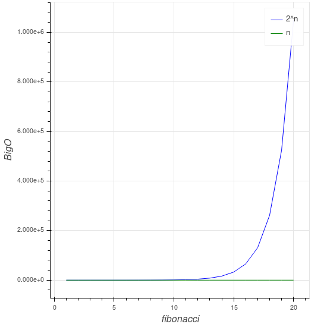

# TypeR

> A superset language implemented in Go that types the R language


> "Incompetentem declaret esse counterproductive"

## Introduction

According to the language site itself, [R](https://www.r-project.org/) is:

> [...] is a language and environment for statistical computing and graphics.

Because it is a scripting language, R seeks to allow flexibility in the development and prototyping of ideas. Through its weak typing system this can be a problem for applications in production -- it is worth noting that this is not a "problem" of language since it was meant to behave the way it is, but this same behavior may end becoming a difficulty to maintain a great code base in the language.

**TypeR** tries to be for R what [TypeScript](https://www.typescriptlang.org/) is for [JavaScript](https://www.javascript.com/), implementing a strong typing system that allows inference and statically typed -- the idea is to go beyond just being types and also to limit the language only to the functional paradigm, cleaning up a little of the multi paradigm of R.

At the end of the day the idea is to write a "functional and typed R code" which will then spit out a normal code in R after all the checks are done, avoiding possible errors when the code is running in production. And if you want to better understand the reason for this decision, you can read more in [functional approach](#Functional-approach); but to give a taste of what this means, the following code...

```R
fibonacci <-function(x) {
  if (0 == x) {
    0
  } else {
    if (1 == x) {
      1
    } else {
      fibonacci(x - 1) + fibonacci(x - 2)
    }
  }
}

fibonacci(40)
```

... in an [laptop](https://www.samsung.com/hk_en/pc/notebook-2-np270e5j-k01/) like:

- Intel(R) Core(TM) i5-4210U CPU @ 1.70GHz
- 8GB of RAM:
  - DDR3
  - 1600 MT/s
- 1TB HD:
  - Timing cached reads:   10046 MB in  1.99 seconds = 5038.70 MB/sec
  - Timing buffered disk reads: 300 MB in  3.02 seconds =  99.44 MB/sec
- Manjaro Linux 18.0.4
- Linux 4.19.56-1-MANJARO

Would result in something like:

- R: 196,50s user 0,42s system 98% cpu 3:20,80 total
- TypeR: 0,00s user 0,00s system 100% cpu 0,002 total

To put it in perspective:



Share your thoughts about this through the [author](#Author) channels of communication.

- [TypeR](#TypeR)
  - [Introduction](#Introduction)
  - [Current working](#Current-working)
    - [Functions](#Functions)
    - [Constants](#Constants)
    - [Variables](#Variables)
  - [How should it supposed to be](#How-should-it-supposed-to-be)
    - [Functions Headers](#Functions-Headers)
      - [Throw notation](#Throw-notation)
    - [Point free notation](#Point-free-notation)
    - [Prefix operations](#Prefix-operations)
    - [Polymorphism](#Polymorphism)
      - [Boundaries](#Boundaries)
    - [Import](#Import)
    - [Export](#Export)
  - [Changes from R](#Changes-from-R)
  - [Why](#Why)
    - [Go](#Go)
      - [And why not use toolings to as Lex and YACC](#And-why-not-use-toolings-to-as-Lex-and-YACC)
    - [Functional approach](#Functional-approach)
  - [TODO](#TODO)
    - [Note](#Note)
  - [Author](#Author)
  - [Reference](#Reference)
    - [Articles](#Articles)
    - [Books](#Books)
    - [Podcasts](#Podcasts)
      - [Hipsters](#Hipsters)
    - [Videos](#Videos)
      - [Logo](#Logo)
      - [Programming](#Programming)

## Current working

### Functions

No need to add the reserved word `function` to declare one:

```TypeR
add <- (x, y) x + y
```

But since compatibility is a blessing, you can type it as well if you want to:

```TypeR
add <- function(x, y) x + y
```

### Constants

```TypeR
result <- add(1, 2)
# result is 3

result <- 4
# This will throw a compiler error, because result is a constant
```

### Variables

If you want to declare a variable, you must use the **let** keyword to do so:

```TypeR
let result <- add(1, 2)
# result is 3

result <- 4
# result is 4
```

## How should it supposed to be

A small example of how language it's supposed to be one day.

**WARNING**: these are just ideas, they may be possible or not.

### Functions Headers

```TypeR
add := Numeric a => a -> a -> a
add <- (x, y) x + y
```

The function header is similar to Haskell's -- read more at [functional approach](#Functional-approach) --; therefore, it also does not need to be declared, the language engine is able to infer the types of the parameters by the operations performed with them in the function body.

```TypeR
multiply <- (x, y) x * y
# multiply := Numeric a => a -> a -> a
```

#### Throw notation

If a function throws an error or a warning, the caller has to know that without having to look at the implementation of the function itself.

```TypeR
isURLValid("www.google.com")
# isURLValid := String -> Bool; throws error, warning
```

### Point free notation

```TypeR
square <- (x) x ^ 2

addTwo <- (x) x + 2

result <- addTwo . square 2
# result is 6
```

### Prefix operations

```TypeR
result <- (+) 1 2
# result is 3
```

### Polymorphism

> More on that later on

#### Boundaries

This is the sketch of an idea, it may not be plausible but it proposes to reduce lines of code and facilitate reusability. If you have any knowledge of C / C ++, you may have seen something like:

```C
typedef myNumber unsigned int;
```

The idea is to start from this to the creation of new variables from others, only expanding it to parametric numerical types, imposing limits of sets intervals for them:

```TypeR
typedef Binary int, [0, 1]
typedef ConfidenceLevel double, [0, 1[
typedef MySet double, Binary U ]1.5, 8.9]
```

That would mean being able to do the following:

```TypeR
normalizeDistribution := Vector[Numeric] -> ConfidenceLevel -> Vector[Numeric]
normalizeDistribution <- (set, level) {
  ...

  return normalized
}
```

Under the hood this means that if these conditions were not followed during the program being run, an error would be given. The idea of this proposal is to clear the code of treatments that the programmer has to do and to be able to reuse those definitions through the code.

### Import

Add support to **import** notation that, later on, transforms it to desired NAMESPACE file:

```TypeR
import sd from stats
import mean from base
import * from graphics
```

### Export

Add keywords to export functions automatically:

```TypeR
export identity <- (x) x
```

The idea to use the match operator is only to use it as a trump card when programing, the NAMESPACE file will import only the used functions.

## Changes from R

- Removing loops as **for**, **while**, **do ... while**;
- Removing the **<<-** operator;
- Changing the `[[ ]]` operator to `[ ]`;
- Changing the `[x, y]` operator to `[x][y]`;
- ...

## Why

The following topics try to clarify the choice of some design decisions.

### Go

As R alone is not a very performative language, Go was chosen to meet such need.

> But why Go and not another language?

The answer is simple, Go is:

- Easy to read and to write tests
- Has a large community and documentation
- Its concurrent design helps when writing a compiler
- ...

#### And why not use toolings to as Lex and YACC

As you can see the processing of language grammar was done without the aid of known tools -- such as [Flex](https://en.wikipedia.org/wiki/Flex_lexical_analyser) and [YACC](https://en.wikipedia.org/wiki/Yacc) -- but this was due to the examples given in the material used in the [reference](#Reference); as the idea of this project is, besides making a new language by itself, to aid the learning of compilers; this approach had a more didactic aspect involved in it.

This is not to say that in a future version, either by flexibility or performance, the tools already mentioned will not be used.

### Functional approach

The choice of just following the functional paradigm is simply a personal decision, since the main use of R for the project author is for mathematical scenarios. Having a background in [Haskell](https://www.haskell.org/), this has greatly influenced prioritizing such a decision.

The example example of Fibonacci is due to the fact that functional languages do not recalculate previously calculated values. In the example, the complexity of the code is `O(2^n)`, where n is the number passed to `fibonacci(n)`; In TypeR this complexity is reduced to `O(n)` due to its functional nature. Comparing the two:



Even if it R does not have some of the practicalities of the functional paradigm like guards and pattern matching, it may be possible to emulate such designs later on.

## TODO

- Right now? Almost everything, the current code state just works as a proof of concept
- Write a draft about the language itself
- **MAYBE** add a way to link a Stack Overflow link to error messages in the VM -- this is a tip from a friend, thank you Lago
- Create syntax support to render Markdown files
- Tooling for TypeR:
  - Create a config file kinda like it [tsconfig](https://www.typescriptlang.org/docs/handbook/tsconfig-json.html) one
  - Create a linter/formatter package for the language so that more flexible patterns are placed and directed to the community to configure them in the way they think best -- [TRLint](https://github.com/Fazendaaa/TRLint)
  - Create a debuger tool
  - Create a testing package
    - Add coverage builtin
    - Add mutation test support to it
  - Support to [VS Code](https://code.visualstudio.com/) in:
    - Linter -- [TRLint](https://github.com/Fazendaaa/TRLint-VSCode)
    - Debuger
    - Testing
  - Create some new tooling like [Monkey Type](https://github.com/instagram/MonkeyType) to migrate R code to TypeR as it is run:
    - That being said, improve this idea by build something "like it" which builds tests cases through the run of the code just so the user approve them later on whether they are consistent or not
  - **MAYBE** a docs package -- [ROxygen](https://klutometis.github.io/roxygen/) is too good to be ignored, that's why this idea is not really a priority:
    - Add an integration with the linter tool to add Big-O notation to the function documentation
  - Create code analyzer to perform duplicity analysis and other things just as [codeclimate](https://codeclimate.com/) already performs
  - Write another package to compile the TypeR code into [Julia](https://julialang.org/) code or/and Haskell itself
- Help out [Romain](https://community.rstudio.com/t/running-go-code-from-r/2340/3) write a Go to R integration package or even allow such integration into TypeR itself
- Once the language is stabilized, rewrite the basic packages of R in it and possibly compile them into machine code to gain performance
  - Also seek to see a way to distribute task execution on multiple machines similar to [Elixir's interactive shell.](https://hexdocs.pm/iex/IEx.html)
  - Dream about ARM, CUDA and RISC V
- Much more

These ideas are "more or less" organized in order of priority, even so it was decided not to order them because it will not necessarily be possible to do them in the proposed order.

### Note

It may take years and years for this project to be ready, but I intend to document each step and then release a series of books or blog posts in an easy and accessible way describing the process of implementing everything from the motive of language creation to the its outcome. This is rather a big project and the idea is that it brings good and great changes.

Thanks Ítalo for letting me use his phrase as the language slogan.

## Author

As the idea is to actually leave this repository just for discussions related to code already present: issues and pull requests, any other questions like project schedule or ask to add new features, you can talk to me about it at:

- [Twitter](https://twitter.com/the_fznd)
- [Telegram](https://t.me/farmy)

## Reference

### Articles

- [R Language Definition](https://cran.r-project.org/doc/manuals/r-release/R-lang.html)
- [Time Complexity Recursive Fibonacci Program](https://www.geeksforgeeks.org/time-complexity-recursive-fibonacci-program/)

### Books

- [Writing An Interpreter In Go](https://interpreterbook.com/)
- [Writing A Compiler In Go](https://compilerbook.com/)

### Podcasts

#### Hipsters

- [Um Pouco de Compiladores](https://hipsters.tech/um-pouco-de-compiladores-hipsters-ponto-tech-105/)
- [Linguagens Funcionais](https://hipsters.tech/linguagens-funcionais-hipsters-91/)
- [Grandes Livros de Tecnologia](https://hipsters.tech/grandes-livros-de-tecnologia-hipsters-113/)

### Videos

#### Logo

- [Inkscape Tutorial: Abstract Galaxy Logo](https://youtu.be/AgbsozDUyTs)
- [Inkscape Tutorial: Custom Lettering](https://youtu.be/Xgw01FV7qQI)

#### Programming

- [Lexical Scanning in Go - Rob Pike](https://youtu.be/HxaD_trXwRE)
- [Sydney Golang Meetup - Rob Pike - Go 2 Draft Specifications](https://youtu.be/RIvL2ONhFBI)
- [Why Go Is Successful (aka Simplicity is Complicated)](https://youtu.be/k9Zbuuo51go)
- [Lambda Calculus - Fundamentals of Lambda Calculus & Functional Programming in JavaScript](https://youtu.be/3VQ382QG-y4)
- [Carl Meyer - Type-checked Python in the real world - PyCon 2018](https://youtu.be/pMgmKJyWKn8)
- [Elixir: A Mini-Documentary (Official Release)](https://youtu.be/lxYFOM3UJzo)
- [GopherCon 2016: Rob Pike - The Design of the Go Assembler](https://youtu.be/KINIAgRpkDA)
